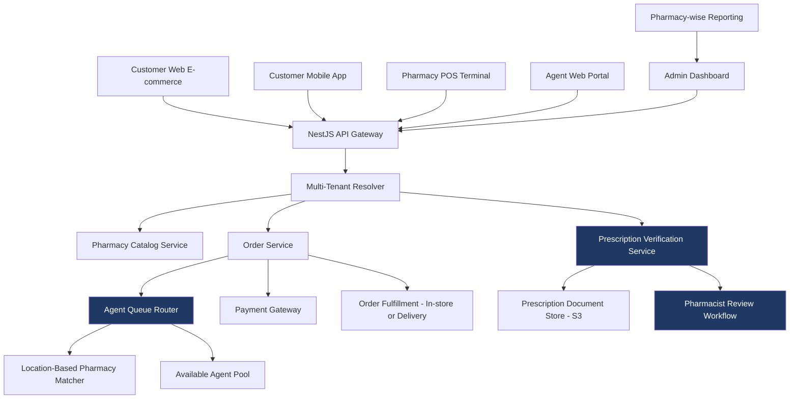

## Context

The French pharmacy regulatory environment is one of the strictest in Europe. Pharmacies cannot sell prescription medications online without verifying the prescription with a licensed pharmacist. They cannot fulfill orders across regional boundaries without specific compliance. They cannot bypass the licensed-pharmacist consultation step.

Our client wanted to bring their network of pharmacies online, end-to-end. That meant building a platform that simultaneously handled e-commerce browsing, prescription verification by licensed agents, in-store POS integration, and mobile delivery — without violating French health regulations at any layer.

---

## My Role

**Director & Chief Technology Officer** — Vriksha Techno Solutions Pvt. Ltd.

- Owned the multi-tenant architecture across pharmacy locations and regional zones
- Designed the prescription verification workflow with the agent queue routing algorithm
- Made the build-vs-buy decisions on telemedicine integration, payment gateways, and prescription validation services
- Coordinated with the French client's legal/compliance team to ensure regulatory alignment
- Led the engineering team through the load testing process and concurrency hardening

---

## Architecture (high level)

---

## Tech Stack

- **Backend:** NestJS, TypeScript, Node.js
- **Database:** MySQL (multi-tenant pharmacy data, regional sharding for scale)
- **Caching:** Redis (catalog reads, session management, agent availability state)
- **Storage:** AWS S3 (prescription document storage with retention policies)
- **Frontend:** React (web e-commerce + admin dashboard), React Native equivalent for mobile, dedicated POS web app for pharmacy terminals
- **Integrations:** French payment gateways, location services, prescription validation APIs

---

## Key Technical Decisions

**Three integrated logins, one platform.**
We resisted the temptation to build separate apps for customer, agent, and admin. Instead we used a unified backend with role-based access control and routed each user type to a different frontend experience. Same data layer, same business logic, different UX shells. Reduced maintenance cost dramatically as features evolved.

**Location-based pharmacy assignment, not round-robin.**
Customers expect their order to come from a nearby pharmacy. We built the order routing to factor in: customer location, pharmacy availability, prescription type, and agent specialty. Round-robin would have been simpler but would have failed customer expectations and regulatory zone requirements.

**Agent queue routing tested at 1,000+ concurrent users from day one.**
French regulations meant every prescription required a real licensed pharmacist to review and approve. With dozens of pharmacies and hundreds of pharmacists, we had a routing problem at scale. We load-tested the queue at 1,000+ concurrent prescription reviews before going live, using a synthetic-load generation harness. We caught and fixed three race conditions that wouldn't have surfaced under normal QA.

**POS as a first-class client, not an afterthought.**
Many e-commerce platforms treat in-store POS as a bolted-on integration. We treated POS as one of the four primary clients of the platform from day one. This let pharmacy owners see online and in-store inventory in real time, fulfill orders from physical stock, and reconcile end-of-day in a single dashboard.

**Prescription verification as a separate service, not a feature.**
Knowing the regulatory requirements would evolve, we built prescription verification as its own service with a clean API. When French regulations changed mid-project (they always do), we updated one service rather than every part of the platform. Architectural insurance that paid off.

---

## Scale & Outcomes

- Multi-tenant deployment across pharmacy locations in the French market
- Agent queue load-tested at 1,000+ concurrent users
- Three integrated user types (Customer, Agent/Doctor, Admin) on a unified backend
- Web e-commerce + POS + mobile delivered as a single platform
- Pharmacy-wise reporting and reconciliation dashboards delivered

(Specific transaction volumes, prescription counts, and revenue figures are confidential to the French client.)

---

## What I'd Do Differently

- **Plan for regulatory churn from day one.** We knew French regulations would evolve, but we underestimated how often. The prescription verification service was already isolated, but other layers needed similar isolation that we only added later.
- **Invest in synthetic load harness earlier.** We built the load-testing harness in month four. Should have built it in month one. Performance assumptions about agent routing and queue management are easy to be wrong about until you measure.
- **Build the pharmacy onboarding flow earlier.** We focused on customer-facing flows first, then realized pharmacy onboarding was a bottleneck for the rollout. A self-serve pharmacy onboarding portal should have been in v1, not v2.

---

## Note

This is a sanitized case study of production work delivered to a private client in the French market. Source code is not included due to confidentiality. Architectural decisions, technology choices, and lessons described here are original and reflect my direct engineering leadership on the project.
